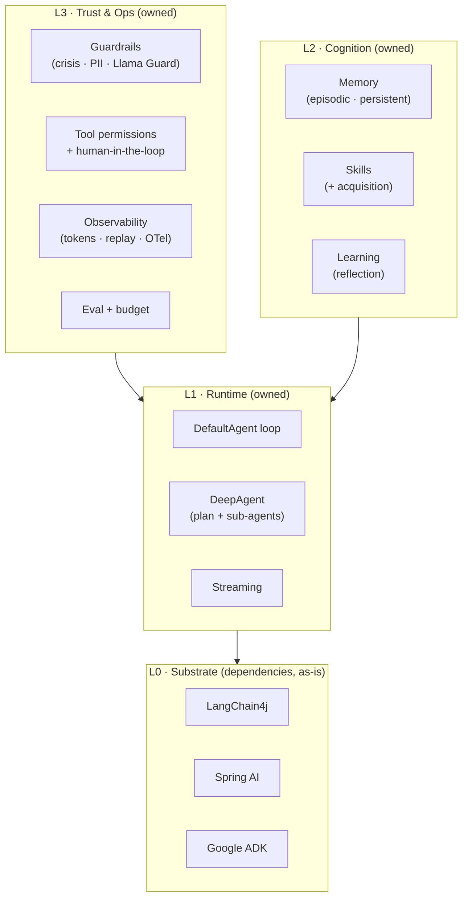
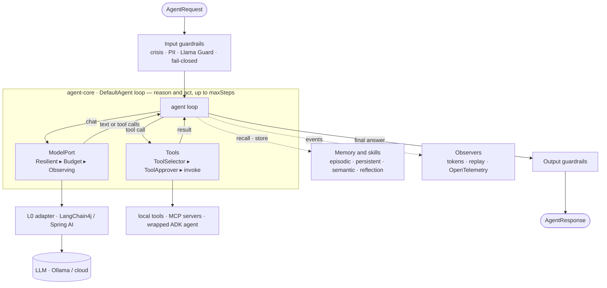
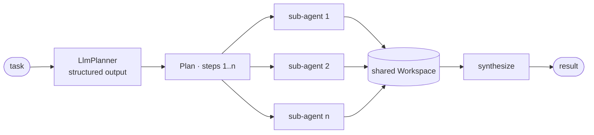

# java-ai-agent

> A **vendor-neutral orchestration + trust layer** for building AI agents on the JVM.
>
> You bring a model (local or cloud) and some tools; `java-ai-agent` gives you a trustworthy,
> long-running **agent** built from them — with planning, memory, skills, guardrails, audit, and
> observability **built in**. It does **not** replace LangChain4j, Spring AI, or Google ADK —
> it **uses them as dependencies** and adds the layer above them that none of them own.

**Status:** a working, tested framework — `./gradlew build` is green and most capabilities are
verified live against a local model.

- **Runtime** — a guardrail-wrapped agent loop with **parallel tool calls** (one step's tool calls run
  concurrently on virtual threads); **deep agents** (plan → parallel sub-agents → synthesize);
  **streaming**.
- **Substrate** — LangChain4j and Spring AI as `ModelPort`s (both with **tool-calling**); Google ADK
  wrapped as an `Agent`; MCP servers' tools as `Tool`s.
- **Trust & ops** — governance at the universal `Agent` seam (`Trust.govern`) so guardrails and the
  deadline apply to any agent (incl. composed/black-box); kidguard guardrails (crisis · PII · local
  **Llama Guard**, fails *closed*); **capability-based tool authorization** (`denyEffectful`:
  read-only runs, effectful denied) + human-in-the-loop; observability (token accounting,
  deterministic replay, **OpenTelemetry**); an **eval harness** + token-**budget** enforcement.
- **Cognition** — episodic memory that is in-memory, **persistent (cross-session)**, or **semantic**;
  skills with progressive disclosure + **acquisition**; a reflective agent that **learns from its
  mistakes** and applies lessons in later sessions.
- **Reliability** — per-call model timeouts + retries and a **per-tool-call timeout**, bounded
  context, graceful model-failure handling, **side-effect-free replay**; **structured output**
  (schema-bound JSON, no fragile parsers).

Discipline borrowed from Mitra: real where cheap, stubbed where expensive, never fake success; trust
is a default; **`agent-core` has zero framework dependencies**.

---

## Install

On **Maven Central** under `io.github.vaiju1981` (latest **0.5.0**; compiles to a Java 21 baseline).
Add the core plus one model adapter:

```kotlin
// build.gradle.kts
implementation("io.github.vaiju1981:agent-core:0.5.0")
implementation("io.github.vaiju1981:agent-anthropic:0.5.0")   // talk to Claude directly
// …or agent-langchain4j (Ollama, OpenAI, …) or agent-spring-ai (any Spring AI ChatModel)
```

```xml
<!-- Maven -->
<dependency>
  <groupId>io.github.vaiju1981</groupId>
  <artifactId>agent-core</artifactId>
  <version>0.5.0</version>
</dependency>
```

**Spring Boot?** Add `io.github.vaiju1981:agent-spring-boot-starter` and inject a governed `Agent` —
autoconfiguration wires the runtime, streaming, and executor for you.

## Quickstart

```java
import dev.vaijanath.aiagent.agent.Agent;
import dev.vaijanath.aiagent.agent.AgentRequest;
import dev.vaijanath.aiagent.agent.DefaultAgent;
import dev.vaijanath.aiagent.anthropic.AnthropicModelPort;
import dev.vaijanath.aiagent.model.ModelPort;

// 1. pick a model — Claude here (reads ANTHROPIC_API_KEY); or Ollama/OpenAI via agent-langchain4j
ModelPort model = AnthropicModelPort.fromEnv();

// 2. build an agent
Agent agent = DefaultAgent.builder()
        .model(model)
        .systemPrompt("You are a concise, accurate assistant.")
        .build();

// 3. run a turn
System.out.println(agent.run(new AgentRequest("Name one benefit of the JVM.")).output());
```

That's the whole "hello agent." From there you add **tools** (plain annotated methods via
`agent-tools-annotations`), expose it as a typed **`@AiService`** interface, wrap the agent in
**`Trust.govern(...)`** for guardrails + tool authorization, persist conversations with
`agent-store-jdbc`, or compose **multi-agent** systems —
every recipe is in the **[Cookbook](docs/COOKBOOK.md)**.

---

## Why it exists

The JVM agent ecosystem is fragmenting — LangChain4j, Spring AI, Google ADK, Embabel, Koog — and
none of them interoperate or ship a serious **trust** story (guardrails, sandboxing, audit,
human-in-the-loop, evals). This project turns that fragmentation into its reason to exist:

> Use any of them as the substrate; get **one** trustworthy runtime, observability story, and
> guardrail layer on top.

It is also designed to be **dogfooded**: the author's own products (Mitra, the kid-safety gateway,
education tools) are intended to run on it — which forces it to be genuinely end-to-end, not a demo.

## Reference application: FinCopilot

[**FinCopilot**](https://github.com/vaiju1981/fincopilot) is a complete, deployable product built on this
framework, in **its own repository** — a **grounded finance copilot** for individuals and small businesses:
per-user accounts & transactions, an Analyst that answers from your real data, a knowledge-grounded Advisor
(with citations + disclaimers), a React dashboard, usage quotas, and data export/delete — on an Ollama
substrate, governed end to end. It depends on the published `io.github.vaiju1981:agent-*` artifacts exactly
as any third-party adopter would — the worked example of building a real product on java-ai-agent.

API stability and upgrades are documented in [docs/API-STABILITY.md](docs/API-STABILITY.md) and the
per-release migration notes (e.g. [docs/MIGRATION-0.2.md](docs/MIGRATION-0.2.md)).

## Architecture (see [DESIGN.md](DESIGN.md))

> Looking for code? The **[Cookbook](docs/COOKBOOK.md)** has copy-pasteable recipes — tools, RAG,
> structured output, multi-agent routing, streaming, and the Spring Boot starter.

**Four layers** — the substrate you depend on, plus the runtime, cognition, and trust layers this
project owns on top:

| Layer | Owner | What |
|---|---|---|
| **L0 — Substrate** | LangChain4j / Spring AI / ADK *(deps, as-is)* | models, tools, RAG, MCP, embeddings |
| **L1 — Runtime** | `java-ai-agent` | control loop, planning, sub-agents (Loom), deep-agent workspace |
| **L2 — Cognition** | `java-ai-agent` | long-term/episodic memory, skills, self-improvement |
| **L3 — Trust & Ops** | `java-ai-agent` | guardrails, permissions/sandboxing, audit, replay, HITL, cost, evals |



### How a request flows

One turn through `DefaultAgent`: input guardrails, then a reason-and-act loop over a (decorated)
`ModelPort` and authorized tools, then output guardrails. The rows of a database, an MCP server's
tools, or a cloud model all sit *outside* the core, reached only through a seam — so `agent-core`
stays dependency-free, and memory, skills, and observers attach without touching the loop.



### Deep agents — plan, fan out, synthesize

A `DeepAgent` plans a task into steps, runs a sub-agent per step **concurrently on Loom virtual
threads** writing to a shared workspace, then synthesizes the result. Each sub-agent is itself an
`Agent`, so any agent — even another `DeepAgent` — composes as a sub-agent with no extra wiring.



## How it compares

It is **not** a competitor to the substrate frameworks — it's the trust + orchestration layer that
runs *on top* of them.

| | java-ai-agent | LangChain4j / Spring AI | Embabel / ADK |
|---|---|---|---|
| Role | trust + orchestration layer **on top** | LLM toolkits | agent frameworks |
| Consumes the others | **yes, as dependencies** | — | wrapped via the `Agent` seam |
| Local-first by default | **yes** | partial | cloud-leaning |
| Built-in safety guardrails | **yes** (Llama Guard, PII, crisis) | no | no |
| Tool authorization + HITL | **yes** | no | no |
| Cross-session learning (persistent) | **yes** | no | no |
| Eval harness + budget enforcement | **yes** | partial | no |
| Zero-dependency core | **yes** | no | no |

## Try it

For the deployment-shaped golden path—not a demo—see the
[`production-reference`](production-reference/README.md) service. It wires the production runtime
to PostgreSQL/Flyway, HikariCP, durable audit, bounded requests, health probes, and Ollama.

For runnable, source-level examples — a minimal agent, multi-tool orchestration, the local safety
layer, cross-session memory, and streaming — see [`examples`](examples/README.md):

```bash
export AGENT_MODEL=gemma4:31b-cloud   # any pulled, tool-capable Ollama model
./gradlew :examples:run -PmainClass=dev.vaijanath.aiagent.examples.ToolUsingAssistant
```

## Modules

- **`agent-core`** — the SPIs and the runtime. **Zero framework dependencies** (only SLF4J).
- **`agent-langchain4j`** — the first reference L0 adapter: a `ModelPort` backed by LangChain4j
  (incl. local models via Ollama), with tool-calling.
- **`agent-spring-ai`** — a second L0 adapter: a `ModelPort` backed by any Spring AI `ChatModel`,
  proving the runtime is vendor-neutral.
- **`agent-anthropic`** — a first-party `ModelPort` over the official Anthropic Java SDK: talk to
  Claude directly, no intermediary framework (`AnthropicModelPort.fromEnv()`).
- **`agent-openai`** — a first-party `ModelPort` over the official OpenAI Java SDK: talk to GPT models
  directly via the Chat Completions API (`OpenAiModelPort.fromEnv()`).
- **`agent-spring-boot-starter`** — Spring Boot autoconfiguration: drop it in and inject a governed
  `Agent` (plus streaming + a request executor) — the path most Spring apps will use.
- **`agent-adk`** — wraps a Google ADK agent as an `Agent` (agent-as-component): ADK is a full
  framework, so it's consumed one level up — the same seam later admits Embabel / Koog.
- **`agent-mcp`** — exposes a Model Context Protocol server's tools as `Tool`s (`McpTools.from(client)`).
- **`agent-a2a`** — Agent-to-Agent over HTTP: `A2aServer` exposes an `Agent`, and `RemoteAgent`
  (itself an `Agent`) calls a remote one, so distributed agents compose like local ones. Dependency-light
  (JDK sockets + `java.net.http`), no `com.sun.*` APIs.
- **`agent-observability-otel`** — optional OpenTelemetry tracing adapter (`OtelAgentObserver`);
  keeps the OTel SDK out of `agent-core`.
- **`agent-store-jdbc`** — a durable, queryable `ConversationStore` for SQLite and PostgreSQL:
  complete turns persist transactionally to relational tables that survive restarts and
  supports SQL analytics; see [agent-store-jdbc/README.md](agent-store-jdbc/README.md).
- **`agent-tools-jsonschema`** — a `ToolArgumentValidator` that validates tool arguments against their
  JSON Schema before the tool runs, so malformed calls are rejected without side effects.
- **`agent-tools-annotations`** — define tools as annotated methods (`@AgentTool` / `@ToolParam`); the
  JSON schema is derived and arguments bound for you (`ReflectiveTools.from(obj)`) — no hand-written schemas.
- **`agent-store-pgvector`** — a pgvector-backed vector store for embeddings-based semantic recall.
- **`agent-store-sqlite`** — an embedded, zero-infra `CheckpointStore` for crash-resumable
  orchestration (survives restarts). *(On `main`; ships in the next release.)*
- **`examples`** — a small, canonical set of runnable agents (minimal agent, tool orchestration, the
  safety layer, cross-session memory, streaming); see [examples/README.md](examples/README.md).
- **`production-reference`** — a deployable Spring Boot/PostgreSQL golden path with migrations,
  pooling, durable audit, safe runtime presets, health probes, and bounded multi-tenant requests.

## Extending it

Everything is an interface; implement the seam you need.

- **A model provider** — implement `ModelPort.chat(ModelRequest) -> ModelResponse` (see
  `LangChain4jModelPort`, `SpringAiModelPort`). Wrap any port in `ResilientModelPort` for
  timeouts/retries.
- **A tool** — implement `Tool` for read-only utilities, or `ContextualTool` for effectful production
  operations that need tenant, principal, deadline, trace, and an idempotency key.
- **A guardrail** — implement `Guardrail.check(stage, content) -> GuardrailDecision` (allow /
  transform / block). Compose them; `Guardrails.kidguard(guardModel)` returns the ordered pipeline.
- **A skill** — `Skill.of(name, description, instructions, tools)`, register it, and a
  `SkillfulAgent` equips it on demand.
- **Memory** — pick an `EpisodicStore`: `InMemoryEpisodicStore`, `FileEpisodicStore` (persistent,
  cross-session), or `LangChain4jEpisodicStore` (semantic, embedding-based recall).
- **Structured output** — declare a result `record` and use `StructuredOutput.generate(request, T.class)`
  (e.g. `OllamaModelPorts.ollamaStructured(...)`); the model returns JSON bound straight to your type,
  so you never write a parser. `LlmPlanner(StructuredOutput)` uses this.
- **An observer** — implement `AgentObserver` (trace/meter/record); failures are isolated.
- **A tool policy** — implement `ToolApprover.authorize(ToolCallContext)` (use `ToolApprovers.allowList(...)`,
  or `ConsoleToolApprover` for human-in-the-loop); wire it via `DefaultAgent.builder().toolApprover(...)`.
- **Evaluate & cap cost** — `Evaluator.run(agent, cases)` reports a pass rate; wrap a `ModelPort` in
  `BudgetModelPort(port, new TokenBudget(n))` to enforce a token ceiling.
- **Stream tokens** — `ModelPorts.stream(port, request, System.out::print)`; a `StreamingModelPort`
  (e.g. `OllamaModelPorts.ollamaStreaming(...)`) forwards tokens live, others fall back to a single chunk.
- **An agent** — implement `Agent.run(AgentRequest) -> AgentResponse`. Because everything is an
  `Agent`, your implementation can be a sub-agent of a `DeepAgent` or the worker of a
  `ReflectiveAgent` with no extra wiring.

## Build & run

Requires a JDK (built/tested on 26; **compiles to a Java 21 baseline** so any 21+ project can
depend on it).

```bash
./gradlew build            # compile + test everything
./gradlew :examples:run    # run the hello-world agent
```

By default the example uses a **stub model** (no network, obvious placeholder output). To run it
against a real local model, start [Ollama](https://ollama.com) and set:

```bash
export AGENT_MODEL=llama3.2        # any pulled Ollama model
export OLLAMA_BASE_URL=http://localhost:11434   # optional, this is the default
./gradlew :examples:run
```

**Safety demo** (`SafeAgent`) — PII scrubbing + a local Llama Guard classifier on input and output:

```bash
ollama pull llama-guard3:1b
AGENT_MODEL=gemma4:31b-cloud ./gradlew :examples:run \
  -PmainClass=dev.vaijanath.aiagent.examples.SafeAgent
```

## Status & roadmap

Current capabilities are listed at the top; project history is in git. Remaining work needs external
systems or accounts, not design changes: live **ADK** / **MCP** end-to-end (a configured ADK model /
a running MCP server) and richer MCP parameter schemas. Releases are published to **Maven Central**
under `io.github.vaiju1981` (see [PUBLISHING.md](PUBLISHING.md)). Architecture and rationale are in
[DESIGN.md](DESIGN.md).

## License

Apache-2.0 — see [LICENSE](LICENSE).
