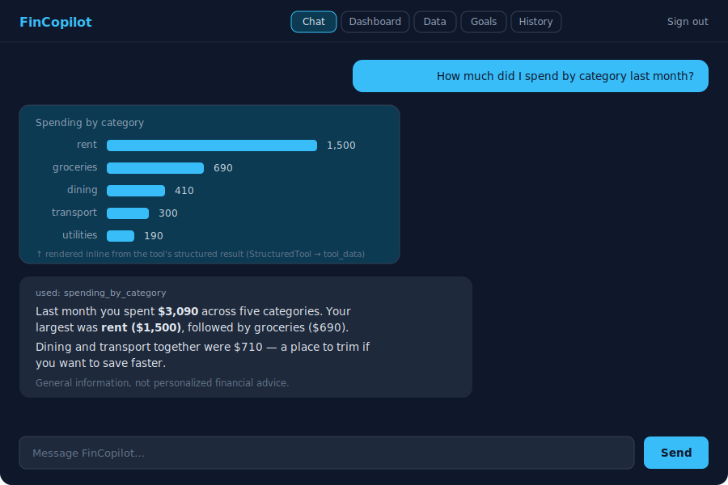
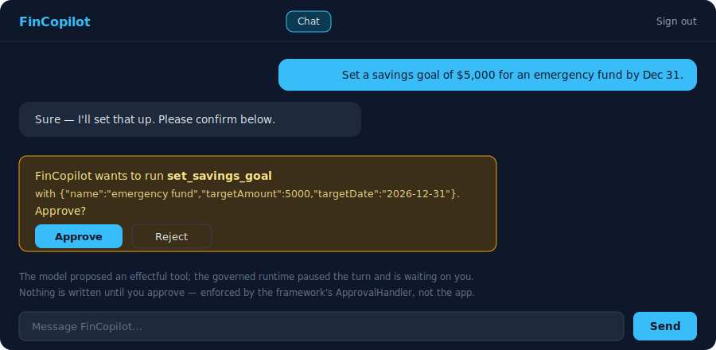
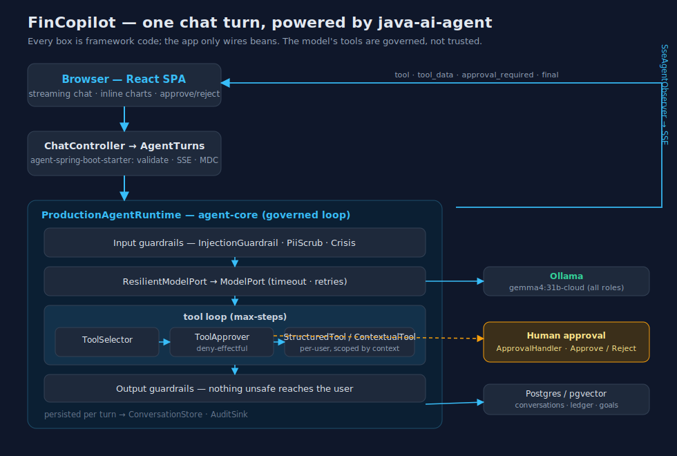

# FinCopilot

The v0.2.0 flagship application — a **grounded finance copilot** for individuals and small businesses,
built on `java-ai-agent`. See [docs/V0.2.0-PLAN.md](../../docs/V0.2.0-PLAN.md) for the full plan.

> **Status: a complete, usable product** (v0.2.x). Login → streaming chat → `docker compose up`: a grounded
> Analyst + Advisor over your own data, savings goals with human-approved actions, conversation history,
> dashboards, metrics/health, and an eval suite.

## Screens

| Grounded chat with inline analytics | Human-in-the-loop approval |
|---|---|
|  |  |

The chat streams answers, renders a tool's **structured result inline** (a chart, not just text), and
**pauses for your approval** before any action that changes your data.

## How a turn works — powered by `java-ai-agent`



Every box above is **framework code from this repo**, not the app — FinCopilot just wires beans and the
`agent-spring-boot-starter` assembles a governed `ProductionAgentRuntime`. Guardrails screen input and
output; the model's tool calls are authorized by a `ToolApprover`; **effectful** tools are gated behind
human approval (`ApprovalHandler`); tools return both model text and a structured payload for the UI
(`StructuredTool`); and the whole turn streams to the browser (`SseAgentObserver`) while persisting to the
`ConversationStore` and `AuditSink`. The app's job is the finance domain; the framework makes the agent
safe, observable, and governable.

## What works today

- **Consumer auth** — `POST /api/auth/{signup,login,logout}`: BCrypt-hashed accounts + opaque
  server-side sessions. The chat API requires a `Bearer` session token.
- A governed agent on the **Ollama** substrate (one model, `gemma4:31b-cloud` by default), with crisis
  + PII guardrails and durable conversation persistence (Postgres), behind auth:
  - `POST /api/chat/turn` — synchronous; returns the guarded `AgentResponse`.
  - `POST /api/chat/stream` — Server-Sent Events: `tool` / `tool_result` events, then a single guarded
    `final` event. (Raw model tokens are never streamed — output guardrails run on the final answer.)
  - `GET /api/chat/sessions` · `GET /api/chat/sessions/{id}` — browse your past conversations and replay
    one (read through the platform's `ConversationHistory` seam, scoped to your user id).
- **Effectful actions with human-in-the-loop approval** — the chat can create a **savings goal**
  (`set_savings_goal`, an effectful tool). The governed runtime won't run an effectful tool without
  approval: it streams an `approval_required` event, the UI shows **Approve/Reject**, and
  `POST /api/chat/approve` resolves it (`GET /api/goals` lists the results). Nothing is written until you
  approve.
- **Ledger + Analyst** (M1): per-user accounts & transactions (manual entry + CSV import,
  `/api/accounts` · `/api/transactions`); the Analyst answers grounded finance questions over your own
  data via READ_ONLY tools (spending-by-category, monthly cashflow, summary); `/api/analytics/*` powers
  the dashboard charts.
- A **React SPA** (`web/`) — sign-up/login, a streaming **Chat** (sessions persist; "New chat" starts a
  fresh one; the analyst's results render inline as charts/tables via the typed-tool-result stream, and
  effectful actions prompt for approval), a **Dashboard** (spending-by-category and monthly-cashflow charts
  + summary), a **Data** view (manual entry + CSV import), a **Goals** view, and a **History** view to
  revisit past conversations — served by nginx.

## Run it

Prerequisites: Docker, and an [Ollama](https://ollama.com) endpoint reachable from the container with
the configured model available (`gemma4:31b-cloud`; for the `-cloud` tag the Ollama host must be signed
in to Ollama cloud).

```bash
cd apps/fincopilot
docker compose up --build
# then open the UI and sign up:
open http://localhost:3000

# ...or drive the API directly (auth required):
TOKEN=$(curl -s http://localhost:8080/api/auth/signup \
  -H 'Content-Type: application/json' \
  -d '{"email":"demo@example.com","password":"password123"}' | sed 's/.*"token":"\([^"]*\)".*/\1/')
curl -sN http://localhost:8080/api/chat/stream \
  -H "Authorization: Bearer $TOKEN" -H 'Content-Type: application/json' \
  -d '{"sessionId":"s1","input":"What can you help me with?"}'
```

The SPA (`web/`, port 3000) proxies `/api` to the backend; develop it with `cd web && npm install && npm run dev`.

The Postgres service uses the `pgvector/pgvector:pg17` image (so the M2 RAG retriever needs no swap).
Ollama runs on the host by default (`OLLAMA_BASE_URL=http://host.docker.internal:11434`).

## Configuration

| Env var | Default | Purpose |
|---|---|---|
| `OLLAMA_BASE_URL` | `http://localhost:11434` | Ollama endpoint |
| `OLLAMA_MODEL` | `gemma4:31b-cloud` | the single model for all roles |
| `DATABASE_URL` / `DATABASE_USER` / `DATABASE_PASSWORD` | local-dev defaults | Postgres connection |

Build just this module: `./gradlew :apps:fincopilot:build`.

## Operations

Deploying and running FinCopilot — full config reference, health/readiness, metrics, structured logging,
load testing, backup/restore, and troubleshooting — is documented in the
[Operations Runbook](docs/OPERATIONS.md). For metrics dashboards, bring up the observability overlay:

```bash
docker compose -f compose.yml -f compose.observability.yml up --build
# Grafana → http://localhost:3001 (dashboard auto-provisioned), Prometheus → http://localhost:9090
```
